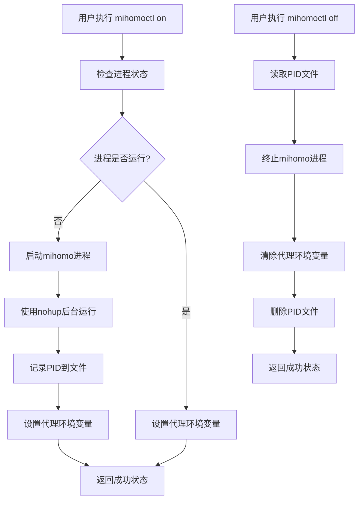

# Design Document

## Overview

本设计文档描述了如何将现有的clash-for-linux-install项目改造为一个用户空间的mihomo代理管理工具。主要改造包括：移除sudo权限依赖、使用用户目录安装、实现用户级进程管理、保持原有命令接口的兼容性。

## Architecture

### 目录结构变更

```
原有结构 (/opt/clash/):          新结构 (~/tools/mihomo/):
├── bin/                        ├── bin/
│   ├── mihomo                  │   ├── mihomo
│   ├── yq                      │   ├── yq
│   └── subconverter/           │   └── subconverter/
├── config.yaml                 ├── config.yaml
├── mixin.yaml                  ├── mixin.yaml
├── runtime.yaml                ├── runtime.yaml
└── script/                     └── script/
    ├── common.sh                   ├── common.sh
    └── clashctl.sh                 └── clashctl.sh
                                └── config/
                                └── logs/

配置目录: ~/tools/mihomo/config/
日志目录: ~/tools/mihomo/logs/
PID文件: ~/tools/mihomo/config/mihomo.pid
```

### 进程管理架构



## Components and Interfaces

### 1. 安装组件 (install.sh)

**功能**: 将mihomo相关文件安装到用户目录
**主要修改**:
- 将 `CLASH_BASE_DIR` 从 `/opt/clash` 改为 `$HOME/tools/mihomo`
- 移除所有 `sudo` 调用
- 移除 systemd 服务创建
- 添加用户级的shell配置更新

**接口**:
```bash
# 输入: 订阅URL (可选)
./install.sh [subscription_url]

# 输出: 安装状态和配置信息
```

### 2. 进程管理组件 (process_manager.sh)

**功能**: 管理mihomo进程的启动、停止和状态检查
**实现方式**:
```bash
# 启动进程
start_mihomo() {
    local pid_file="$MIHOMO_BASE_DIR/config/mihomo.pid"
    local log_file="$MIHOMO_BASE_DIR/logs/mihomo.log"
    
    if is_mihomo_running; then
        return 0
    fi
    
    nohup "$BIN_MIHOMO" -d "$MIHOMO_BASE_DIR" -f "$MIHOMO_CONFIG_RUNTIME" \
        > "$log_file" 2>&1 &
    echo $! > "$pid_file"
}

# 停止进程
stop_mihomo() {
    local pid_file="$MIHOMO_BASE_DIR/config/mihomo.pid"
    if [ -f "$pid_file" ]; then
        local pid=$(cat "$pid_file")
        kill "$pid" 2>/dev/null
        rm -f "$pid_file"
    fi
}

# 检查进程状态
is_mihomo_running() {
    local pid_file="$MIHOMO_BASE_DIR/config/mihomo.pid"
    [ -f "$pid_file" ] && kill -0 "$(cat "$pid_file")" 2>/dev/null
}
```

### 3. 配置管理组件 (config_manager.sh)

**功能**: 管理配置文件的读取、写入和合并
**主要修改**:
- 移除所有 `sudo` 调用
- 使用用户权限读写配置文件
- 保持原有的配置合并逻辑

**接口**:
```bash
# 合并配置文件
merge_config() {
    "$BIN_YQ" eval-all '. as $item ireduce ({}; . *+ $item)' \
        "$MIHOMO_CONFIG_MIXIN" "$MIHOMO_CONFIG_RAW" \
        > "$MIHOMO_CONFIG_RUNTIME"
}

# 更新配置项
update_config() {
    local key=$1
    local value=$2
    "$BIN_YQ" -i ".$key = $value" "$MIHOMO_CONFIG_MIXIN"
}
```

### 4. 订阅管理组件 (subscription_manager.sh)

**功能**: 处理订阅URL的下载、转换和更新
**主要修改**:
- 移除 `sudo` 调用
- 使用用户权限管理订阅文件和日志
- 保持原有的subconverter集成

### 5. 命令行接口组件 (mihomoctl.sh)

**功能**: 提供统一的命令行接口
**主要修改**:
- 移除所有 systemctl 调用
- 使用新的进程管理函数
- 保持原有命令接口兼容性

## Data Models

### 配置文件结构

```yaml
# ~/tools/mihomo/config.yaml (主配置)
mixed-port: 7890
allow-lan: false
mode: rule
log-level: info
external-controller: '127.0.0.1:9090'

# ~/tools/mihomo/mixin.yaml (用户自定义配置)
system-proxy:
  enable: true
external-controller: "0.0.0.0:9090"
secret: ""

# ~/tools/mihomo/runtime.yaml (运行时配置)
# 由 config.yaml 和 mixin.yaml 合并生成
```

### 进程状态文件

```bash
# ~/tools/mihomo/config/mihomo.pid
# 包含mihomo进程的PID

# ~/tools/mihomo/config/url
# 包含当前使用的订阅URL

# ~/tools/mihomo/logs/mihomo.log
# mihomo进程的运行日志

# ~/tools/mihomo/logs/update.log
# 订阅更新日志
```

## Error Handling

### 1. 权限错误处理
- 检查用户目录的读写权限
- 在权限不足时提供清晰的错误信息
- 自动创建必要的目录结构

### 2. 端口冲突处理
- 检测端口占用情况
- 自动选择可用端口
- 更新配置文件中的端口设置

### 3. 进程管理错误处理
- 检查进程是否正常启动
- 处理进程意外退出的情况
- 提供进程状态查询功能

### 4. 配置文件错误处理
- 验证配置文件格式
- 在配置错误时回滚到备份
- 提供配置修复建议

## Testing Strategy

### 1. 单元测试
- 测试各个组件的独立功能
- 模拟不同的错误场景
- 验证配置文件处理逻辑

### 2. 集成测试
- 测试完整的安装流程
- 验证进程启动和停止功能
- 测试订阅更新流程

### 3. 用户场景测试
- 在无sudo权限环境下测试
- 测试不同shell环境的兼容性
- 验证代理功能的正常工作

### 4. 兼容性测试
- 测试与原有命令接口的兼容性
- 验证配置文件格式的兼容性
- 测试不同Linux发行版的兼容性

## Implementation Notes

### 关键修改点

1. **目录路径变更**:
   - 所有 `/opt/clash` 路径改为 `$HOME/tools/mihomo`
   - 配置文件路径改为 `$HOME/tools/mihomo/config/`
   - 日志文件路径改为 `$HOME/tools/mihomo/logs/`

2. **权限管理**:
   - 移除所有 `sudo` 调用
   - 使用用户权限进行文件操作
   - 确保端口使用非特权端口

3. **进程管理**:
   - 使用 `nohup` 和 PID 文件替代 systemd
   - 实现进程状态检查和管理功能
   - 处理进程的优雅启停

4. **环境变量管理**:
   - 在用户shell配置中设置代理环境变量
   - 提供代理开关功能
   - 支持多种shell环境

5. **自动更新**:
   - 使用用户级 crontab 替代系统级定时任务
   - 保持原有的更新逻辑和错误处理