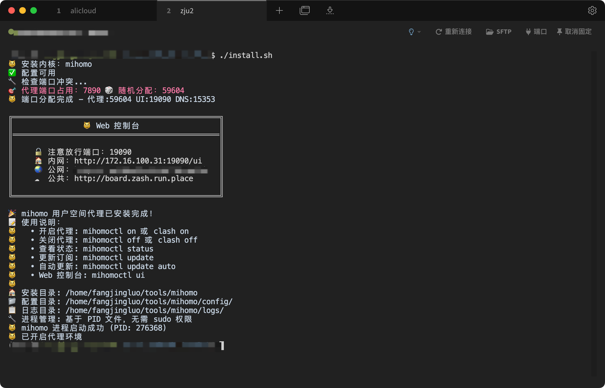

# Clash for Lab - 实验室科学上网工具




## 项目简介

Clash for Lab 是专为实验室环境设计的科学上网解决方案，基于 [clash-for-linux-install](https://github.com/nelvko/clash-for-linux-install) 项目进行二次开发。

### 为什么选择 Clash for Lab？

实验室用户通常面临以下困难：
- **无 sudo 权限**：无法安装系统级服务或修改系统配置
- **无 GUI 环境**：只能通过命令行操作，无法使用图形界面工具
- **端口冲突频繁**：多用户共享服务器，常用端口经常被占用
- **网络限制严格**：需要稳定可靠的代理工具进行学术研究

Clash for Lab 完美解决了这些问题.

### 核心特性

- **用户空间运行**：无需 `sudo` 权限，安装到用户目录 `~/tools/mihomo/`
- **端口管理**：自动检测端口冲突并分配可用端口
- **命令行操作**：完全基于命令行，适合无 GUI 环境
- **多架构支持**：适配主流 Linux 发行版（CentOS、Debian、Ubuntu 等）
- **进程管理**：基于 PID 文件管理，无需 systemd 服务
- **订阅转换**：自动使用 [subconverter](https://github.com/tindy2013/subconverter) 进行本地订阅转换

## 快速开始

### 环境要求

- **用户权限**：普通用户权限即可，**无需 sudo 或 root**
- **Shell 支持**：`bash`、`zsh`、`fish`
- **代理订阅**：需要有效的 Clash 订阅链接

### 安装步骤

#### 1. 克隆项目

```bash
git clone https://github.com/saladday/clash-for-lab.git
cd clash-for-lab
```

#### 2. 运行安装脚本

```bash
bash install.sh
```
> 默认会安装在`~/tools/mihomo/`目录下

TODO: 自定义安装路径

安装过程中会：
- 自动检测系统架构
- 下载适配的 mihomo 内核
- 配置用户环境变量
- 设置命令行别名
- 检测并分配可用端口

#### 3. 配置订阅

安装完成后，设置你的代理订阅：

```bash
clash subscribe https://your-subscription-url
```

#### 4. 启动代理

```bash
clash on
```

### 验证安装

```bash
# 检查服务状态
clash status

# 测试网络连接
curl -I https://www.google.com
```

## 使用教程

### 基本命令

执行 `clash help` 查看所有可用命令：

```bash
$ clash help
Usage:
    clash COMMAND  [OPTION]
    mihomo COMMAND [OPTION]
    mihomoctl COMMAND [OPTION]

Commands:
    on                      开启代理
    off                     关闭代理
    restart                 重启代理服务
    proxy    [on|off]       系统代理环境变量
    ui                      Web 控制台地址
    status                  进程运行状态
    tun      [on|off]       Tun 模式 (需要权限)
    mixin    [-e|-r]        Mixin 配置文件
    secret   [SECRET]       Web 控制台密钥
    subscribe [URL]         设置或查看订阅地址
    update   [auto|log]     更新订阅配置


```

### 日常使用流程

#### 1. 启动代理服务

```bash
clash on
```

#### 2. 检查运行状态

```bash
# 查看详细状态信息
clash status

# 输出示例：
# 😼 订阅地址: https://your-subscription-url
# 😼 mihomo 进程状态: 运行中
# 😼 进程 PID: 276368
# 😼 运行时间: 04:53
# 😼 配置文件: /home/fangjingluo/tools/mihomo/runtime.yaml
# 😼 日志文件: /home/fangjingluo/tools/mihomo/logs/mihomo.log
# 😼 代理端口: 54016
# 😼 管理端口: 19090
# 😼 DNS端口: 15353
# 😼 系统代理：开启
# http_proxy： http://127.0.0.1:54016
# socks_proxy：socks5h://127.0.0.1:54016
```

#### 3. 停止代理服务

```bash
# 停止代理
clash off
```

### 高级功能

#### Web 控制台管理

```bash
# 查看控制台地址
clash ui

# 设置访问密钥（推荐）
clash secret your-password

# 查看当前密钥
clash secret
```

通过浏览器访问 Web 控制台可以：
- 切换代理节点
- 查看实时日志
- 监控流量统计
- 测试节点延迟

#### 订阅管理

```bash
# 设置订阅地址
clash subscribe https://your-subscription-url

# 查看当前订阅
clash subscribe

# 更新订阅配置
clash update

# 设置自动更新（每2天）
clashu pdate auto

# TODO:自定义更新天数
```


#### 高级配置

```bash
# 编辑自定义配置（Mixin）
clash mixin -e

# 查看运行时配置
clash mixin -r

# 启用 TUN 模式（暂时还不好用,建议别用）
clash tun on
```


### 故障排除


#### 1. 代理不生效

```bash
# 检查服务状态
clash status

# 测试代理连接(使用代理端口)
curl -x http://127.0.0.1:xxx -I https://www.google.com

# 重启服务
clashrestart
```

#### 2. 订阅更新失败

```bash
# 检查订阅地址
clash subscribe

# 手动更新订阅
clash update

# 查看更新日志
clash update log
```

### 卸载

```bash
bash uninstall.sh
```

## 项目结构

```
clash-for-lab/
├── install.sh              # 主安装脚本
├── uninstall.sh            # 卸载脚本
├── script/                 # 脚本目录
│   ├── clashctl.sh         # 主控制脚本
│   └── common.sh           # 公共函数库
├── resources/              # 资源文件
│   ├── config.yaml         # 默认配置模板
│   ├── mixin.yaml          # Mixin 配置模板
│   ├── Country.mmdb        # GeoIP 数据库
│   └── bin/                # 预编译二进制文件
└── README.md               # 项目文档
```

### 安装后目录结构

```
~/tools/mihomo/             # 用户安装目录
├── bin/                    # 二进制文件
│   ├── mihomo              # 主程序
│   ├── subconverter        # 订阅转换工具
│   └── yq                  # YAML 处理工具
├── config/                 # 配置文件
│   ├── config.yaml         # 主配置文件
│   ├── mixin.yaml          # 自定义配置
│   ├── mihomo.pid          # 进程 ID 文件
│   └── Country.mmdb        # GeoIP 数据库
├── logs/                   # 日志文件
│   └── mihomo.log          # 运行日志
└── ui/                     # Web 控制台文件
```


## 常见问题

### Q: SSH 断开后代理服务会停止吗？
A: 不会。服务使用 `nohup` 在后台运行，SSH 断开后仍然保持运行。

### Q: 如何在多个终端会话中使用代理？
A: 代理服务是全局的，在任何终端中执行 `clash on` 后，所有终端都可以使用代理。

### Q: 可以同时运行多个实例吗？
A: 不建议。每个用户建议只运行一个实例，避免端口冲突和配置混乱。

### Q: 如何更换订阅地址？
A: 使用 `clash subscribe new-url` 命令更换，系统会自动更新配置。

### Q: Web 控制台无法访问怎么办？
A: 检查防火墙设置，确保控制台端口（默认 9090）可以访问。如果是远程访问，需要配置端口转发。


## 致谢

本项目基于 [clash-for-linux-install](https://github.com/nelvko/clash-for-linux-install) 进行二次开发，感谢原作者的优秀工作。

### 相关项目

- [mihomo](https://github.com/MetaCubeX/mihomo) - 高性能的代理内核
- [subconverter](https://github.com/tindy2013/subconverter) - 订阅转换工具
- [yacd](https://github.com/haishanh/yacd) - Web 控制台界面
- [yq](https://github.com/mikefarah/yq) - YAML 处理工具

### 参考资料

- [Clash 知识库](https://clash.wiki/)
- [Clash 配置文档](https://clash.wiki/configuration/configuration-reference.html)
- [mihomo 文档](https://wiki.metacubex.one/)

## 许可证

本项目采用与原项目相同的开源许可证。

## 免责声明

1. 编写本项目主要目的为学习和研究 Shell 编程，不得将本项目中任何内容用于违反国家/地区/组织等的法律法规或相关规定的其他用途。
2. 本项目保留随时对免责声明进行补充或更改的权利，直接或间接使用本项目内容的个人或组织，视为接受本项目的特别声明。
3. 使用本项目所产生的任何后果由使用者自行承担。


